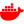

<!--
**pablomarino/pablomarino** is a ✨ _special_ ✨ repository because its `README.md` (this file) appears on your GitHub profile.

Here are some ideas to get you started:

- 🔭 I’m currently working on ...
- 🌱 I’m currently learning ...
- 👯 I’m looking to collaborate on ...
- 🤔 I’m looking for help with ...
- 💬 Ask me about ...
- 📫 How to reach me: ...
- 😄 Pronouns: ...
- ⚡ Fun fact: ...
-->

<h2 align="center">🦀 Hi, I'm Pablo Mariño! 🦀</h2>

I am a <b>Front-End Developer</b> on a journey to become Full-Stack.

Those are my tools :

  
  

  
  

  
  

  

  
  

  
... although they are not the only ones...

  

  

  
  
  
  

  
  
  

I am also involved on side projects like <b>Environment Logger</b>. A personal device to measure Air, Noise and Light pollution 🏭 focused on urban environment and health 
  or <b>OpenPet</b> a web app to help people find and adopt pets 🐕 from animal shelters.

You can find me  
  <b>Learning</b> every day || <b>Making</b> things || exploring software <b>Craftmanship</b>

<h3 align="center">Reach me at:<h3>

 · 
  
  <!---->

